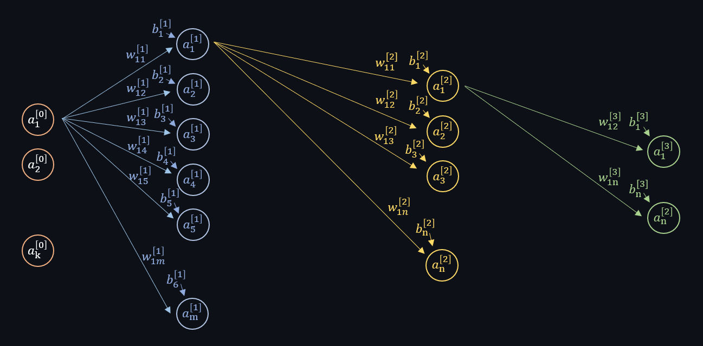
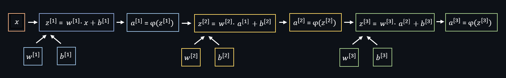
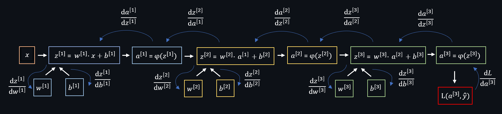
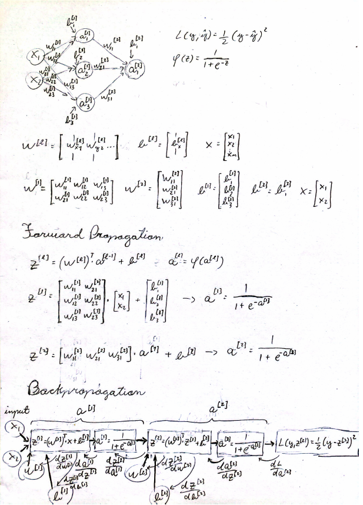
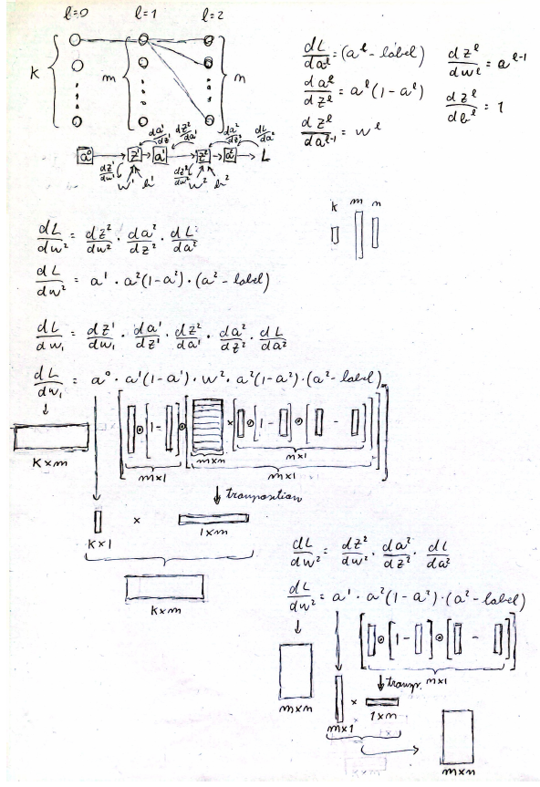

# NN-from-scratch
Development of a neural network using only basic math operations

### 1. [Introduction](#introduction)
### 2. [Math behind](#math-behind)

- #### 2.1. [Forward pass](#forward-pass)
- #### 2.2. [Backpropagation](#backpropagation)
- #### 2.3. [Optimization](#optimization)

### 3. [Algorithms and functions](#algorithms-and-functions)
### 4. [Results and metrics](#results-and-metrics)

## Introduction
The project is a dense neural network with variable number of layers and layer sizes as well as its training and testing routines.
It was developed as a way to validate the knowledge aquired in the AI2 classes of THI University about how a dense neural network works in its lowest level.

## Math behind

$ŷ$ : Output activations vector (prediction)

$y$ : Label vector (how the output should be)

$x$ : Input vector

$\varphi(z)$ : Activation function

$L(y, ŷ)$ : Loss function

$w^{[l]}$ : Weight matrix for the layer l

$a^{[l]}$ : Activations matrix for the layer l

$b^{[l]}$ : Biases matrix for the layer l

 

    

### Forward pass:
It is the process o making the prediction, calculating the activation layer by layer until the last one, the output.

    

Activation function chosen: sigmoid $\sigma(z) = \frac{1}{1 + e^{-z}} $

$z^{[l]} = w^{[l]} \cdot a^{[l-1]} + b^{[l]}$ 

$a^{[l]} = \varphi (z^{[l]})$

### Backpropagation:
It is the process of calculating the gradients of the Loss function relative to the weights and biases, done by calculating the derivatives of each function and applying the chaing rule.

    

Derivative of RME loss function $ ( L(y, ŷ) = \frac{1}{2} \cdot(y - ŷ)^2 ) $ 

$\frac{{\ dL}}{{da^{[l]}}} = a^{[l]} - y$

Derivative of Sigmoid activation function:

$\frac{da^{[l]}}{{dz^{[l]}}} = a^{[l]} \cdot (1 - a^{[l]})$

 

$\frac{dz^{[l]}}{{da^{[l-1]}}} = w^{[l]}$

$\frac{dz^{[l]}}{{dw^{[l]}}} = a^{[l-1]}$

$\frac{dz^{[l]}}{{db^{[l]}}} = 1$

 
Chain rule aplication:

 

$\frac{dL}{{dw^{[3]}}} = \frac{dz^{[3]}}{{dw^{[3]}}}  \cdot  \frac{da^{[3]}}{{dz^{[3]}}} \cdot  \frac{{dL}}{{da^{[3]}}}$

$\frac{dL}{{dw^{[2]}}} =  \frac{dz^{[2]}}{{dw^{[2]}}} \cdot \frac{da^{[2]}}{{dz^{[2]}}} \cdot \frac{dz^{[3]}}{{da^{[2]}}}  \cdot   \frac{da^{[3]}}{{dz^{[3]}}} \cdot  \frac{{dL}}{{da^{[3]}}}$

$\frac{dL}{{dw^{[1]}}} =  \frac{dz^{[1]}}{{dw^{[1]}}} \cdot \frac{da^{[1]}}{{dz^{[1]}}} \cdot \frac{dz^{[2]}}{{da^{[1]}}} \cdot \frac{da^{[2]}}{{dz^{[2]}}} \cdot \frac{dz^{[3]}}{{da^{[2]}}}  \cdot   \frac{da^{[3]}}{{dz^{[3]}}} \cdot  \frac{{dL}}{{da^{[3]}}}$

 

### Optimization:
Is the process of updating the weights

#### Stochastic gradient descent (SGD):

$factor_{SGD} = \frac{dz^{[l]}}{{dw^{[l]}}}$

$w_{new} = w - \alpha \cdot factor_{SGD}$

$b_{new} = b - \alpha \cdot factor_{SGD}$

Adam:

#### Adam optimizer is a combination of SGD with momentum, on the numerator, and RMSProp, on the denumerator.

$\beta_1$ : Momentum constant (usually 0.9)

$\beta_2$ : RMSProp constant (usually 0.999)

$\epsilon$ : constant to prevent division by 0 (usually 1e8)

$factor_{Adam} = \frac{m_{k}}{\epsilon + \sqrt{r_{k}}}$

$m_{k} = \beta_1 \cdot m_{k-1} + (1-\beta_1) \cdot \frac{dL}{dw}$

$r_{k} = {\epsilon + \sqrt{\beta_2 \cdot r_{k-1} + (1-\beta_2) \cdot (\frac{dL}{dw})^2}}$

 

$w_{new} = w - \alpha \cdot factor_{Adam}$

$b_{new} = b - \alpha \cdot factor_{Adam}$

Correction factor: Everytime when you apdate the weights you have to multiply the $factor_{Adam}$ by the correction factor. If you are using mini batch (I used on this project), you accumulate the factors and after the batch size is reached you update the weights with the accumulated factors, and just at this moment you apply the correction factor. It's NOT applyed when it's accumulating the values.

$n:$ Sample index

Correction factor for $   m_{k}: 1-\beta_1^n $

$(m_{k})_{corrected} =  \frac{m_{k}}{1-\beta_1^n}$

Correction factor for $   r_{k}: 1-\beta_2^n $

$(r_{k})_{corrected} =  \frac{r_{k}}{1-\beta_2^n}$

## Algorithms and functions
The neural network was creates as the class NN() initialized just with the arguemnt "params", which is a list where each position of the list repesent a layer and the value represents the number of nodes of the respective layer, e.g. a net with 2 hidden layers each one with 60 nodes. the input layers with 10 nodes and the ouput with 1 layer -> params = [10, 60, 60, 1]

### Reset functions
Implemented methods: 
- reset_cumulated_gradients(self)
- reset_cumulated_adam_factors(self)

The reset functions are necessary because the optimiation algorithms uses cumulated values and eventually they must be reset to start from the begining. In the case of cumulated gradients of weights and biases, they must be reset after every batch, and for $m_{k}$ (momentum factor) and $r_{k}$ (RMS Prop factor) every epoch. 

### Forward function
Implemented method: forward(self, input, activation_func)
The forward function is the simpler one, it defines a list for the activations to be added as they are calculated, it loops through the layers multiplying the previous activation values by the weights and adding the biases for the hidden layers, and if the last layer it appleys the output activation intead of the activation for the hidden layers, that are usually different.

### Backpropagation
Implemented method: backpropagation(self, label, batch_size, activation_func, optimizer)

For the back propagation, the idea is to identify the patterns on the calculations and use it on the algorithm. For example, to create a function that allow the user to choose the size of the net, we must be able to adapt the backpropagation calculation to the net size (number of nodes and number of layers), and by looking at the mathematical expression for the backpropagation, as the numbers of nodes grow, its possible to notice the pattern 

### Optimization
Implemented method: optimization(self, alpha, optimizer, sample_index)

### Training loop

## Record of the initial development 

    
    

